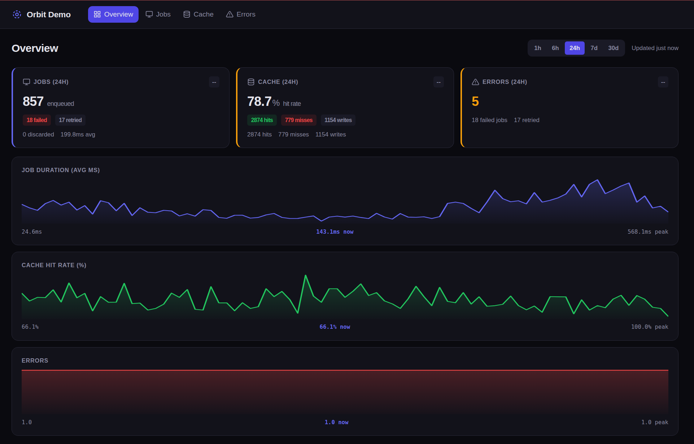

# rails_orbit

[](https://github.com/dev-ham/rails_orbit/actions/workflows/ci.yml)
[](https://badge.fury.io/rb/rails_orbit)
[](https://opensource.org/licenses/MIT)

A mountable Rails engine that gives you an observability dashboard for applications running the Solid stack — `solid_queue`, `solid_cache`, and `solid_errors`. Mount it, and you get real-time metrics without external services.

## Why rails_orbit

Rails 8 ships with Solid Queue, Solid Cache, and Solid Errors. They work great, but there is no single place to see how they are performing. rails_orbit fills that gap:

- One `/orbit` route gives you jobs, cache, and error metrics in a single dashboard.
- Zero external dependencies — no Redis, no Datadog, no Prometheus.
- Non-blocking writes using `concurrent-ruby` so your app stays fast.
- Works with SQLite, Postgres, MySQL, or any database URL.

## Requirements

- Ruby >= 3.1
- Rails >= 7.1
- At least one of: `solid_queue`, `solid_cache`, `solid_errors`

## Quick Start

```ruby
# Gemfile
gem "rails_orbit"
```

```bash
bundle install
bin/rails generate rails_orbit:install
```

The generator creates an initializer, a migration, and mounts the engine route. What happens next depends on your storage adapter:

**SQLite (default):** The table is created automatically when the app boots. No migration needed — Orbit uses its own `db/rails_orbit.sqlite3` file, separate from your app's database.

**Host database or external:** Run the migration so the table lands in your primary database:

```bash
bin/rails db:migrate
```

Set credentials for the dashboard:

```bash
export ORBIT_USER=admin
export ORBIT_PASSWORD=secret
```

Visit `/orbit` in your browser. That is it.

### Screenshot

Overview with the range picker and interactive charts (example from a demo workload):



### Useful Commands

```bash
bin/rails rails_orbit:setup   # manually create the metrics table
bin/rails rails_orbit:status  # show config, adapter, table status, metric count
```

## Dashboard

The dashboard has four pages, all with a dark theme and live updates via Turbo Streams.

Every page includes a **date range picker** — choose from 1h, 6h, 24h (default), 7d, or 30d to view historical data.

### Overview

The main page shows your application health at a glance:

- **Jobs** — enqueued, failed, retried, and discarded counts with hourly trend arrows
- **Cache** — hit rate with a visual bar, plus hits, misses, and write counts
- **Errors** — total error count with severity coloring
- **Interactive charts** — three SVG area charts for Job Duration, Cache Hit Rate, and Error Count. Hover over any point to see the exact value and timestamp.
- **Live refresh** — a "last updated" indicator shows when data was last fetched

Each card has a colored left border that shifts from green to amber to red based on thresholds.

Charts use bucketed SQL aggregation (not raw data) so they stay fast even at the 30-day range.

### Jobs

A detailed per-queue breakdown:

- Summary cards at the top — total enqueued, average duration, failed, discarded
- A table showing each queue with columns for enqueued, avg duration, failed, retried, and discarded
- Rows with failures get a subtle red background so they stand out
- All counts scoped to the selected date range

### Cache

Full cache performance visibility:

- Total reads split into hits and misses (not just a combined number)
- A visual hit-rate bar — green fill represents the hit percentage
- Write, delete, and fetch-hit counts
- Miss rate shown separately so you can spot cache warming issues

### Errors

Exceptions grouped by class for faster triage:

- Each exception class shows occurrence count and "last seen" time
- Up to 5 recent messages displayed per group
- **Error location** — the exact `file:line in method` where each exception originated, taken from the first application frame of its most recent occurrence
- **Full traceback** — expand any error to see the complete backtrace, with application frames highlighted and gem frames de-emphasized and shortened
- Resolved status shown if solid_errors supports it
- Scoped to the selected date range

## Storage Adapters

| Adapter | Config | When to Use |
|---------|--------|-------------|
| SQLite (default) | `:sqlite` | Local dev, VPS, persistent volumes |
| Host database | `:host_db` | Heroku, Railway, managed PaaS |
| External URL | `:external` | PlanetScale, Neon, Turso |

Using `:sqlite` on platforms with ephemeral filesystems (Heroku, Railway) will lose data on deploy. The gem detects this and warns you.

```ruby
RailsOrbit.configure do |config|
  config.storage_adapter = :host_db
end
```

For an external database:

```ruby
RailsOrbit.configure do |config|
  config.storage_adapter = :external
  config.storage_url     = ENV["ORBIT_DATABASE_URL"]
end
```

## Configuration

```ruby
# config/initializers/rails_orbit.rb
RailsOrbit.configure do |config|
  config.storage_adapter  = :sqlite       # :sqlite, :host_db, or :external
  config.retention_days   = 7             # auto-purge metrics older than this
  config.poll_interval    = 5             # seconds between live updates
  config.dashboard_title  = "Orbit"       # shown in nav and page title
  config.kamal_enabled    = false         # enable Kamal container stats
end
```

## Authentication

The dashboard is protected by a configurable auth block. Three common patterns:

### HTTP Basic (default)

Set `ORBIT_USER` and `ORBIT_PASSWORD` environment variables. No code changes needed.

### Devise

```ruby
config.authenticate_with do |controller|
  controller.authenticate_user!
  controller.head(:forbidden) unless controller.current_user&.admin?
end
```

### Custom

```ruby
config.authenticate_with do |controller|
  unless controller.session[:orbit_authenticated]
    controller.redirect_to controller.main_app.root_path, alert: "Not authorized"
  end
end
```

## Instrumentation

rails_orbit automatically subscribes to these ActiveSupport notifications:

| Source | Events Captured |
|--------|----------------|
| solid_queue | enqueued, performed (with duration), failed, retried, discarded |
| solid_cache | read hit, read miss, write, delete, fetch hit |
| solid_errors | error recorded (with exception class) |

All writes happen in a background thread. If the write queue is full, events are discarded rather than blocking your app.

## Data Retention

Schedule the built-in retention job to keep your database lean:

```yaml
# config/recurring.yml (solid_queue)
rails_orbit_retention:
  class: "RailsOrbit::RetentionJob"
  schedule: "0 2 * * *"
```

This deletes metrics older than `retention_days` (default: 7).

## Kamal Integration

Optional SSH-based container stats polling. Disabled by default.

```ruby
# Gemfile
gem "sshkit", "~> 1.21"
```

```ruby
RailsOrbit.configure do |config|
  config.kamal_enabled      = true
  config.kamal_ssh_key_path = Rails.root.join(".kamal", "id_ed25519")
end
```

Reads `config/deploy.yml` to discover servers. Collects CPU and memory stats from Docker containers every 30 seconds.

**Security:**
- SSH key path must be set explicitly — never auto-discovered
- Never commit SSH keys to your repository
- Only enable in production environments

## Contributing

```bash
git clone https://github.com/dev-ham/rails_orbit.git
cd rails_orbit
bundle install
bundle exec rspec
```

Tests run against a dummy Rails app in `spec/dummy/`.

1. Fork the repo
2. Create a branch (`git checkout -b feature/my-feature`)
3. Run tests: `bundle exec rspec`
4. Commit and push
5. Open a Pull Request

## License

MIT License. See [LICENSE.txt](LICENSE.txt).
